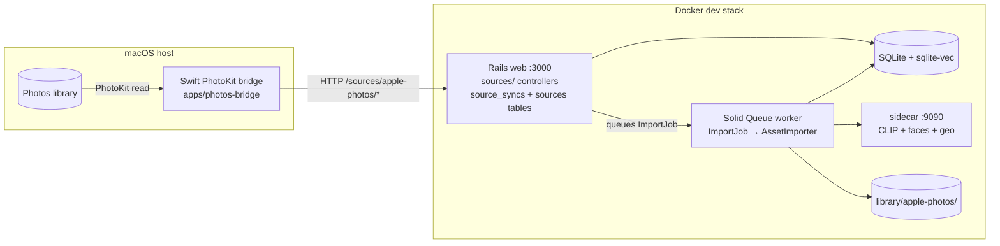

# Apple Photos Bridge Protocol (Phase 4) Discovery

## Summary

The reference `pics` app reads a macOS Photos library through a **Swift
PhotoKit bridge** (`apps/photos-bridge`) because a `.photoslibrary` bundle is an
opaque, application-managed package that a Linux/Docker container cannot
traverse. PhotoKit is the sanctioned way to read it: it handles macOS
authorization, primary-resource extraction, edits, and iCloud-backed originals.

The bridge is **unchanged** in the Rails port — it only speaks HTTP. Rails must
implement the same `/sources/apple-photos/*` contract the FastAPI app exposes,
so the same binary can drive either backend by changing `--api-url`. That
contract is Phase 4:

1. A **sync state machine** over the `source_syncs` table (queued → running →
   done/partial/error) with lease-based stale recovery.
2. A **bridge heartbeat** that keeps the `sources` row's
   `bridge_status`/`authorization_state`/`asset_count` fresh, expiring to
   `offline` after a short lease.
3. A **full-sync dedupe** endpoint (`/assets/known`) so a full import does not
   re-upload the entire library every run.
4. A **multipart upload** endpoint that lands files in
   `library/apple-photos/{uuid}.{suffix}`, upserts an asset keyed by
   `source_asset_id`, and queues the existing Rails import job.
5. **Catalog overview integration** — the per-source funnel math, readiness
   logic, `sync` object, and `photos_libraries` context (fed by the deferred
   `/admin/library` inventory walk).

The schema already exists in the Rails fork (Phase 1 created all 17 tables
including `sources` and `source_syncs` with the bridge fields). **Phase 4 is
pure controller/service/view work — no schema churn.**

## In-depth review

### The two systems that must agree

**Client (Swift, read-only reference, NOT built here).** `main.swift` flow:

1. Request Photos access; send a `bridge/heartbeat` with
   `{authorization_state, asset_count}`.
2. In `--watch` mode, loop every `--poll-interval` seconds: heartbeat again,
   then `POST /sources/apple-photos/sync/claim`; if a sync is returned, fetch
   assets, extract primary resources (PhotoKit, `isNetworkAccessAllowed = true`
   for iCloud originals), upload each as multipart, then `complete` the sync.
3. In bounded mode it uploads the `limit` most-recent assets (sorted by
   `creationDate` desc). In full mode it walks the whole library in chunks of
   500, calling `POST /assets/known` per chunk to skip assets Rails already
   has, then uploads only the unknown ones.

Key payload details the Rails side must match exactly:
- `source_asset_id` is `asset.localIdentifier` and **contains `/`** — it must
  be a multipart *form field*, never a route segment.
- `taken_at` is an ISO8601 string; `media_type` is `image` or `video`;
  `asset_count` and `authorization_state` are echoed on every upload (they feed
  `mark_source_status`).
- `POST /sync/claim` and `POST /sync/{id}/complete` are sent as
  `application/x-www-form-urlencoded`; `sync`, `assets/known`, and `heartbeat`
  are JSON. Complete sends `imported_count`, `failed_count`, and an optional
  URL-encoded `error`.
- Mime: images are sent as `application/octet-stream`, videos as
  `video/quicktime`. The server stores `file.content_type` on the asset row;
  the import pipeline later refines it via ExifTool.

**Server (to be built).** `apps/api/api/sources.py` is the contract reference.

### The sync state machine (`source_syncs`)

| Endpoint | Behavior |
|---|---|
| `POST /sync` `{limit, full}` | Recover stale running syncs; if any queued/running sync exists return it with `already_active: true`; else insert `{source_id, limit_count, full_sync}` with status `queued` |
| `GET /sync/status` | Recover stale; return the latest sync row (or `{sync: null}`) |
| `POST /sync/claim` | Recover stale; `UPDATE ... SET status='running', started_at=? WHERE id=? AND status='queued'` (first queued by id); return claimed row or `{sync: null}` |
| `POST /sync/{id}/complete` | Form `imported_count`, `failed_count`, `error` → `status = partial` if error && imported_count, `error` if error alone, else `done`; set `completed_at`, counts, `error` |

**Stale recovery.** `_recover_stale_syncs` marks any `running` sync whose
`started_at` is older than `PICS_SOURCE_SYNC_LEASE_SECONDS` (default 3600) as
`status='error', error='bridge lease expired'`. Run at the start of `sync`,
`sync/status`, and `claim` so a crashed bridge cannot wedge the queue.

**Claim is not reusable.** The `WHERE status='queued'` guard makes a second
claim while one is running return `{sync: null}`.

### Bridge heartbeat and lease (`sources`)

- `POST /bridge/heartbeat` `{authorization_state, asset_count}` →
  `bridge_status = authorization_required` for
  `denied|restricted|notDetermined`; `inventory_pending` when `asset_count == 0`;
  else `connected`. Sets `bridge_last_seen_at = now(UTC)`.
- `_source_with_bridge_status` (used by `/status` and the catalog apple entry):
  if `bridge_last_seen_at` is older than `PICS_BRIDGE_LEASE_SECONDS` (default
  **15** — the bridge heartbeats every 5s), report `bridge_status = offline`.

### Full-sync dedupe (`POST /assets/known`)

`{source_asset_ids: [...]}` (1..500) → return the subset whose
`(source_id, source_asset_id)` exists in `assets` with `deleted = 0`. Without
this, full sync re-uploads the whole library every run.

### Multipart ingest (`POST /assets`)

1. Look up existing non-deleted asset by `(source_id, source_asset_id)`.
2. **Duplicate + processed or active import** → return
   `{status:'duplicate', duplicate:true, asset_id}` (no re-queue). "Active
   import" means a queued/working `import` job whose `params.paths` contains
   the asset path.
3. **Duplicate + not processed and no active import** → re-queue an import job,
   return `{status:'queued', duplicate:true, retried:true, asset_id, job_id,
   path}`. This recovers a previously-failed import without re-uploading the
   file.
4. **New** → write to `library/apple-photos/{uuid4hex}{suffix}` where suffix is
   the lowercased extension of `original_filename || file.filename` defaulting
   to `.jpg`; insert/upsert the asset row with `sha256`, `size_bytes`, mime
   (content_type), `taken_at`, `created_at`, `extra='{}'` (upsert updates
   `original_filename`, `path`, `deleted=0`); queue the import job; call
   `mark_source_status(connected, auth, count)`; return `{status:'queued',
   duplicate:false, asset_id, job_id, source_asset_id, path}`.

### Catalog overview apple entry (`catalog.py`)

`_apple_entry` builds the per-source stages from real data instead of the
Phase 3 placeholder:
- `discovered = source.asset_count` (bridge-reported library total)
- `imported` / `searchable` / `processing` / `stuck` from a per-source asset
  scan keyed on presence of `content_embeds` and active job paths
- `ready_to_import = max(0, asset_count - imported)`
- `importing` from an active (queued/running) latest sync — bounded sync shows
  `min(limit_count, ready_to_import)`, full sync shows the whole backlog
- `failed_or_blocked = stuck + latest_sync.failed_count` (partial/error only)
- `readiness` from: auth state → `authorization_required`; failed latest sync →
  `failed`; `last_error` → `failed`; never synced + `not_connected` →
  `not_configured`; `asset_count == 0` and no done/partial sync →
  `inventory_pending`; else `connected`
- payload adds `bridge_status`, `bridge_last_seen_at`, `authorization_state`,
  and the `sync` object (latest `source_syncs` row)

`context.photos_libraries` comes from `cached_library_inventory()` (see below).

### Admin library inventory (`admin.py`, deferred from Phase 1)

`GET /admin/library` walks `PICS_WATCH_ROOT` (TTL-cached, default 60s,
serialized under a lock): collects `*.photoslibrary` directory names (pruned
from the walk — PhotoKit owns their contents), counts media files by
extension, and reports catalog counts (`assets`, `mounted_assets`, `faces`).
The catalog overview uses it for both `photos_libraries` **and** the
mounted-folder source's `discovered` count (`inventory.media_files`).

## Architecture diagrams



```mermaid
sequenceDiagram
    participant B as Swift bridge (macOS)
    participant R as Rails app
    participant DB as SQLite

    B->>R: POST bridge/heartbeat {auth, asset_count}
    R->>DB: upsert bridge_status, last_seen_at
    R-->>B: {source}

    B->>R: POST sync {limit: 25}
    R->>DB: recover stale; insert source_syncs queued
    R-->>B: {sync: {id, limit_count, full_sync:0}, already_active}

    loop claim loop (every poll interval)
        B->>R: POST sync/claim
        R->>DB: queued -> running, started_at
        R-->>B: {sync: {...}}
        loop for each candidate asset
            alt full sync
                B->>R: POST assets/known {source_asset_ids[]}
                R-->>B: {source_asset_ids: existing}
            end
            B->>R: POST assets (multipart file + source_asset_id + taken_at + ...)
            R->>DB: write library/apple-photos/<uuid>; upsert asset
            R->>R: queue ImportJob
            R-->>B: {status: queued, asset_id, job_id}
        end
        B->>R: POST sync/{id}/complete {imported_count, failed_count, error?}
        R->>DB: running -> done | partial | error
        R-->>B: {sync: {...}}
    end
```

## Use cases

1. **Bounded import (default).** User clicks "Import latest 25"; bridge picks up
   the sync on its next poll and streams the 25 most recent assets. Good default
   for a first connection or incremental day-to-day use.
2. **Full sync after initial setup.** The user runs "Import entire library" once.
   `assets/known` chunked in 500s prevents re-uploading what already landed in
   bounded runs. This is the case where skipping `/assets/known` is a silent
   disaster — the whole library re-uploads every time.
3. **Headless bridge recovery.** User starts `--watch` on macOS; the bridge
   heartbeats every 5s and processes queued syncs. If the Mac sleeps or the
   bridge dies mid-sync, the stale-running sync is marked `error` after the
   sync lease, and the next request proceeds cleanly.
4. **Failed import retry.** An asset uploads but its import job errored (e.g.
   transient sidecar outage). The next upload for the same `source_asset_id`
   re-queues the existing file (`retried: true`) without re-transferring bytes.

Where it does **not** fit: anything that must read the Photos library *without*
macOS/PhotoKit (Linux, CI, servers). The `mounted_folder` source already covers
plain directories with no bridge involved. The protocol is also not a sync of
*edits or deletions* — deleted Photos assets are not propagated; `deleted=0`
assets are simply never re-created on re-upload.

## Alternatives

- **Access `.photoslibrary` directly (no bridge).** Rejected by the reference
  design: the bundle is an opaque app-managed package; a Linux container cannot
  traverse it reliably, and iCloud-backed originals require PhotoKit's
  `isNetworkAccessAllowed`. The bridge is the sanctioned path and the port
  keeps it.
- **osxphotos / libraries.** A CLI that exports from a Photos library; still
  runs on macOS and reintroduces a custom tool instead of reusing the proven
  bridge binary. Loses the single-HTTP-client story.
- **Polling the JSON contract (React-style).** The reference polls
  `/catalog/overview` + `/sync/status` every 3s. The Rails way replaces this
  with Turbo Stream broadcasts when sync state changes — but note the sync
  state changes are driven by the *bridge* (external), so a broadcast has to be
  fired from the Rails endpoint handlers (e.g. after `sync`, `claim`,
  `complete`), not from a background job.

## Limitations, risks & gotchas

- **`source_asset_id` contains `/`.** It is a form field, never a URL segment —
  routing it as `:id` breaks.
- **The current Rails `ImportJob` deletes the file on import failure**
  (`FileUtils.rm_f(path) if job&.kind == "import"`). For Apple Photos uploads
  the file in `library/apple-photos/` is the *only* copy of the original; this
  behavior must be guarded (e.g. only delete when the source is `uploads`), or
  Phase 4 will silently destroy library originals on a transient import error.
- **Two leases with different scales.** Sync lease is an hour (a full sync can
  be long); bridge lease is 15 seconds (heartbeat every 5s). Confusing them
  either wedges the queue or flips the bridge to `offline` constantly.
- **`already_active` semantics.** A second sync request while one is active
  returns the active sync — it does *not* 409. Clients rely on the returned
  `already_active` flag.
- **Complete-status precedence.** `error && imported_count` → `partial`;
  `error` alone → `error`; else `done`. Getting this wrong mislabels partial
  imports as failures.
- **`asset_count == 0` means `inventory_pending`, not "empty".** The readiness
  logic treats a fresh bridge (no reported totals) differently from a confirmed
  empty library. The UI shows "Connected. Reading your Photos library
  inventory…".
- **Multipart mime is unreliable.** The bridge sends `application/octet-stream`
  for images and `video/quicktime` for videos; ExifTool refines the real mime
  during import, so the stored mime should not be trusted for thumbnail/embed
  decisions before import runs.
- **Jobs params format.** The reference stores `{"paths": [...]}` in `jobs.params`
  and the "active import" check parses it. The Rails `ImportJob` takes
  `(job_id, path, index, total)` and the params blob is `{paths:[path]}`, so
  the active-import helper must parse the same shape.
- **Turbo vs. polling for sync state.** The bridge, not Rails, advances sync
  state. To keep the photos page live without the reference's 3s polling, the
  Rails endpoint handlers (or a `SourceSync` model broadcast) must emit Turbo
  Stream updates to the `"catalog"` region on sync create/claim/complete.
- **Bridge command in UI copy.** The reference instructs `pnpm bridge:watch`
  against `:8000`. The Rails port must show the equivalent command pointed at
  `:3000` (e.g. `swift run PicsPhotosBridge --watch --api-url
  http://localhost:3000`), otherwise the copy is wrong.
- **Env vars to add:** `PICS_SOURCE_SYNC_LEASE_SECONDS`, `PICS_BRIDGE_LEASE_SECONDS`,
  `PICS_INVENTORY_CACHE_TTL` — none exist in `config/initializers/pics.rb` yet.
- **`mark_source_status` sets `last_sync_at`** on every upload/heartbeat path,
  which feeds the "reported_at" freshness label — keep that wiring, it is part
  of the contract, not an optional nicety.

## References

- Reference server contract: `apps/api/api/sources.py` (all 8 endpoints),
  `apps/api/api/catalog.py` (`_apple_entry`, `_readiness`, `_processing_counts`),
  `apps/api/api/admin.py` (`_library_inventory`, `_cached_library_inventory`,
  `GET /admin/library`).
- Reference client (read-only): `apps/photos-bridge/Sources/PicsPhotosBridge/main.swift`.
- Reference tests (the Phase 4 acceptance surface): `apps/api/tests/test_sync.py`,
  `apps/api/tests/test_sources.py`, `apps/api/tests/test_full_sync.py`,
  `apps/api/tests/test_catalog.py` (apple funnel + readiness cases).
- Reference UI to port: `apps/web/app/photos/page.tsx` (SourceCard, sync
  controls, ConfirmDialog), `apps/web/lib/funnel.ts` (`bridgeLabel`,
  `freshnessLabel`), `apps/web/lib/api.ts` (`applePhotosStatus`,
  `requestApplePhotosSync`, `applePhotosSyncStatus`), `apps/web/types.ts`.
- Core helpers: `packages/core/core/sources.py` (`get_source`,
  `mark_source_status`, `classify_path`), `packages/core/core/jobs.py` (`push`).
- Rails-side planning docs: this repo's `artifacts/.../rails-port-discovery.md`
  (§2.3 bridge obligations, §2.1 endpoint contract) and Phase 1 plan (deferred
  list).