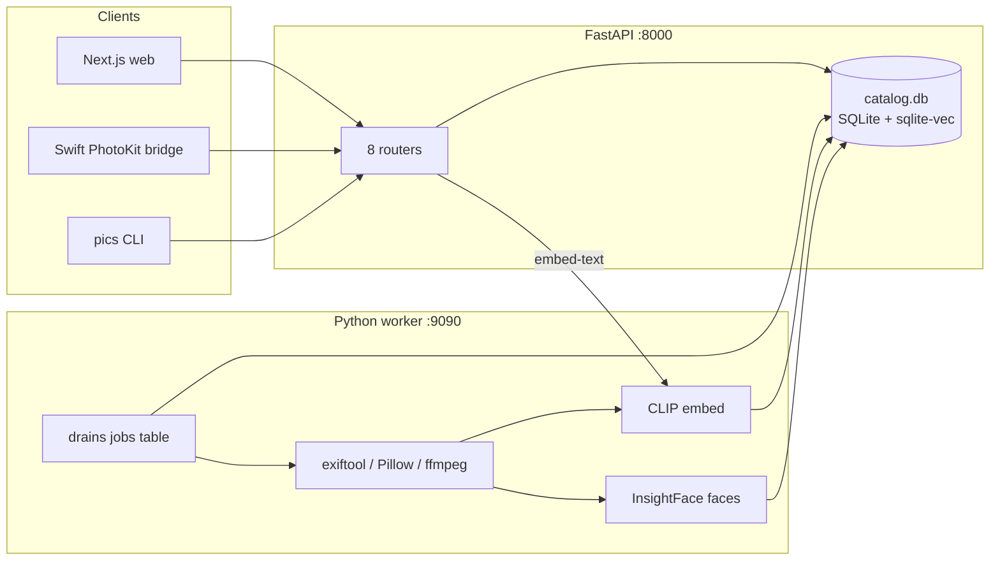
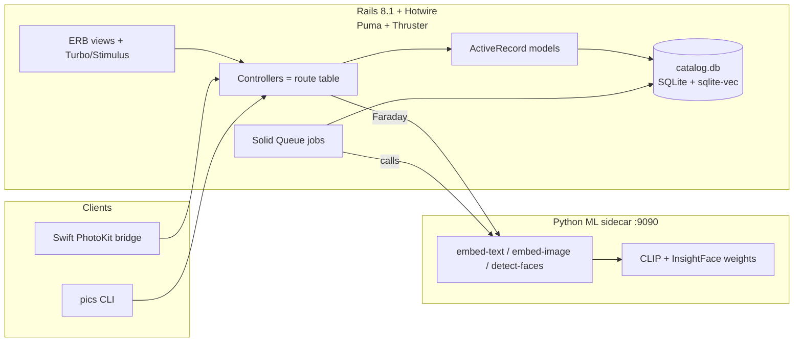
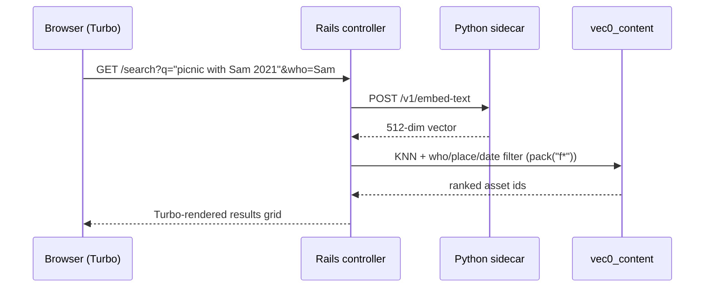

# Porting photo-searchable-library to Ruby on Rails — Discovery

## 1. Summary

This is a discovery for porting the existing **photo-searchable-library**
(Next.js + FastAPI + Python ML worker + Swift bridge, all in one monorepo) to a
**Ruby on Rails** implementation, while keeping the existing Python/TypeScript
implementation working. The goal is **two working implementations** — this is a
**fork**, not a rewrite of the original in place. Each implementation owns its
own codebase, its own container stack, and its own database. **There is no
shared database layer and no schema-compatibility requirement between the two.**
The Rails app is designed on its own merits; the existing catalog schema is a
starting blueprint it is free to evolve.

What exists today (the "current implementation"):

- `apps/web` — Next.js 16 / React 19 UI (search, catalog funnel, people review,
  places, admin/settings).
- `apps/api` — FastAPI backend. Owns `catalog.db` (SQLite), all read/write
  endpoints, job queue writer, and delegates text embedding to the worker.
- `packages/core` — shared Python: schema, sqlite-vec connection, asset/embed/
  geo/clustering/settings/sources/jobs logic.
- `services/worker` — Python ML worker: CLIP image/text embeddings
  (`transformers`/`torch`), InsightFace face detection + embeddings, ExifTool +
  ffmpeg + Pillow metadata/thumbnail pipeline, a polling watcher, and an
  internal FastAPI embed service on `:9090`. It drains a SQLite `jobs` table.
- `tools/cli` — `pics` CLI (scan, query, upload, strip-exif, cluster, people).
- `apps/photos-bridge` — Swift/macOS PhotoKit bridge that talks to the FastAPI
  HTTP API only.

The port target (the "Rails implementation"):

- A **full-stack Rails 8.1 app** — the current Rails default is server-rendered
  views with **Hotwire** (Turbo Drive/Frames/Streams + Stimulus), **SQLite** as
  the default database, **Solid Queue** for background jobs (no Redis), **Solid
  Cache**, **Solid Cable**, **Propshaft**, and **Thruster + Kamal** for deploy.
  That is "the Rails way" for the current version, and it replaces both the
  Next.js UI *and* the FastAPI backend in one deployable.
- **SQLite + sqlite-vec remain the Rails storage engine on their own merits.**
  The `sqlite-vec` gem (`SqliteVec.load(conn)`) is an official Ruby binding, so
  the Rails app keeps the same single-file, embedded-vector design (SQL + KNN in
  one DB, no separate vector server). This is a *design choice for the fork*, not
  a compatibility requirement with the Python catalog.
- **A slim Python ML inference sidecar.** CLIP text/image embeddings and
  InsightFace face detection have no practical pure-Ruby equivalent, so they
  remain in a small, stateless Python process that exposes `POST /v1/embed-text`,
  `POST /v1/embed-image`, `POST /v1/detect-faces`, and `GET /v1/status`. It owns
  **no database and no application logic** — it is a model server, not a Python
  web server for the app. Everything else (EXIF, thumbnails, reverse geocoding,
  clustering, search, the whole UI) moves to Ruby/Rails.

Why this matters: the current stack is split across three runtimes (Node,
Python, Swift) plus Docker Compose. Rails collapses the web + API into one
process/stack, keeps the ML as a pure inference dependency, and leaves the Swift
bridge untouched because it only speaks HTTP. The two forks are independent:
each is booted, tested, and deployed on its own against the same kind of library
directory and its *own* catalog file.

## 2. In-depth review

### 2.1 The current system, precisely

**Request/response surface (the compatibility contract).** The entire web UI,
the Swift bridge, and the CLI talk HTTP to the FastAPI app on `:8000`. The exact
endpoints are:

```
GET    /                                  health
GET    /search?q&who&place&before&after&tag&limit
GET    /admin/status                      (counts, settings, models_ready, disk)
GET    /admin/settings
PATCH  /admin/settings                    (watch_enabled, watch_backfill)
GET    /admin/library                     (inventory walk + catalog counts)
POST   /admin/scan                        (queue a scan job)
GET    /catalog/overview                  (funnel, sources, context)
POST   /assets/upload                     (multipart -> import job)
GET    /assets/{id}/thumbnail             (JPEG bytes from files BLOB table)
GET    /jobs                              (list, statuses)
GET    /jobs/{id}
GET    /persons                           (persons + suggestions + enrichment)
GET    /persons/search?q
POST   /persons/cluster
PATCH  /persons/{id}                      (rename)
POST   /persons/{id}/aliases
DELETE /persons/{id}/aliases/{alias_id}
POST   /persons/{id}/faces/{face_id}      (manual assign)
POST   /persons/{id}/split
POST   /persons/{keep}/merge/{remove}
POST   /persons/suggestions/{id}/confirm
POST   /persons/suggestions/{id}/reject
POST   /persons/suggestions/{id}/restore
GET    /persons/faces/{face_id}/crop      (JPEG from disk, path-guarded)
GET    /places
GET    /sources/apple-photos/status
POST   /sources/apple-photos/sync
GET    /sources/apple-photos/sync/status
POST   /sources/apple-photos/sync/claim
POST   /sources/apple-photos/sync/{id}/complete
POST   /sources/apple-photos/assets/known
POST   /sources/apple-photos/bridge/heartbeat
POST   /sources/apple-photos/assets        (multipart asset upload)
```

**Data model (`catalog.db`, SQLite + sqlite-vec).** `packages/core/core/schema.py`
creates 17 tables and 2 virtual tables: `assets`, `files` (BLOB store for
thumbnails), `sources`, `source_syncs`, `persons`, `person_aliases`, `faces`,
`content_embeds` (512-dim float32 BLOB per asset), `face_embeds`, `clustering_runs`,
`cluster_suggestions`, `face_assignments`, `person_faces`, `settings`, `tags`,
`jobs`, `schema_meta`, plus `vec0_content` and `vec0_face` virtual tables for KNN.
The connection (`core/conn.py`) enables the `sqlite-vec` extension, WAL mode, and
`busy_timeout=5000`. Embeddings are serialized as little-endian float32 arrays
(`array.array("f")`), which is byte-for-byte the same as Ruby's `[0.1, ...].pack("f*")`
on x86_64/ARM64.

**Import pipeline (worker).** For each file: ExifTool extracts `taken_at`, GPS,
mime, size, camera (`worker/exif.py`); Pillow/`pillow-heif` or ffmpeg produce a
≤512px JPEG thumbnail (`worker/thumbnail.py`); GPS → city/country via offline
`reverse_geocoder` (`core/geo.py`); asset upserted into `assets` + thumbnail into
`files` (`core/assets.py`); CLIP image embedding → `content_embeds` + `vec0_content`
(`core/embeds.py`); InsightFace detects faces → crops written to
`library/.crops/{uuid}.jpg` + 512-dim face embeddings → `face_embeds`/`vec0_face`.
Faces clustering (`core/clustering.py`) is a separate job: DBSCAN (cosine) over
face embeddings → `clustering_runs`/`cluster_suggestions`/`face_assignments`.
Human confirm/rename/merge/split then writes `person_faces`.

**Search flow.** `GET /search?q=...` → FastAPI POSTs the text to the worker's
`/v1/embed-text` (`api/deps.py embed_text`) → `content_knn` against `vec0_content`
→ post-filters by `who`/`place`/`before`/`after`/`tag` (`api/search.py`).

**Jobs.** A SQLite `jobs` table is both the queue and the progress store. The
API/CLI insert rows (`kind`, `params` JSON); the worker `claim()`s the next
`queued` row, marks it `working`, updates `progress`, then `done`/`error`. The
UI polls `GET /jobs` every ~1s.

**Deployment.** `docker-compose.yml`: `api` (:8000, health-gated on worker),
`worker` (:9090, downloads CLIP + InsightFace models into a `models` volume),
`web` (:3000). Volumes `catalog`, `library`, `models`; `$HOME/Pictures` mounted
read-only as `/media/photos`. The worker image is large (~4GB) because of torch.

### 2.2 The port target architecture

```
Rails 8.1 full-stack app (Puma, Thruster)
  ├── ERB views + Turbo (Drive/Frames/Streams) + Stimulus
  ├── Controllers mirroring the FastAPI route table (above)
  ├── ActiveRecord models over the Rails catalog schema (fork's own DB)
  ├── sqlite-vec loaded via SqliteVec.load on connection init
  ├── Solid Queue (ActiveJob) for scan/import/cluster jobs
  ├── ruby-vips (HEIC/AVIF) + ffmpeg (video) for thumbnails
  ├── mini_exiftool (same exiftool binary) for metadata
  └── HTTP client -> Python ML sidecar for embeddings/faces
                                            │
        Python ML sidecar (:9090, stateless) │  torch + transformers + insightface
          POST /v1/embed-text                │  no DB, no app logic
          POST /v1/embed-image               │
          POST /v1/detect-faces              │
          GET  /v1/status                    │
```

**What moves where (component map).**

| Current component | Rails replacement |
|---|---|
| `apps/web` Next.js UI | ERB views + Turbo + Stimulus (Hotwire) |
| `apps/api` FastAPI routers | Rails routes + controllers (same path table) |
| `packages/core/schema.py` | ActiveRecord migrations, `schema_format = :sql` (blueprint to port; the fork may evolve it) |
| `packages/core/conn.py` (sqlite-vec, WAL) | `sqlite3` + `sqlite-vec` gems, initializer loads extension |
| `core/embeds.py` (KNN) | Raw `vec0_content`/`vec0_face` SQL with `pack("f*")` blobs |
| `core/assets.py` (upsert, files BLOB) | `Asset`/`StoredFile` models + service objects |
| `core/jobs.py` (SQLite queue) | Solid Queue for execution + a `jobs` table kept for the API contract |
| `core/settings.py` | `Setting` model or a small key-value store |
| `core/sources.py` (path classify) | Service object, same env vars (`PICS_LIBRARY`, `PICS_WATCH_ROOT`) |
| `core/clustering.py` (DBSCAN) | Ruby with `numo-narray`, or sidecar `/v1/cluster-faces` (see §6) |
| `core/geo.py` (reverse geocode) | Bundled GeoNames cities in SQLite + haversine KNN, or sidecar |
| `worker/exif.py` | `mini_exiftool` gem (same `exiftool` binary) |
| `worker/thumbnail.py` | `ruby-vips` (libvips, native HEIC/AVIF) + ffmpeg for video |
| `worker/models.py` (CLIP) | **stays Python** — slim sidecar |
| `worker/faces.py` (InsightFace) | **stays Python** — slim sidecar |
| `worker/watcher.py` (polling thread) | Solid Queue recurring job (schedule every 30s) |
| `worker/service.py` / `run.py` | Slim sidecar: embed/face HTTP endpoints only |
| `tools/cli` | Thor-based `pics` CLI (same commands), or keep Python CLI hitting the Rails API |
| `apps/photos-bridge` (Swift) | **unchanged** — HTTP contract only |
| `docker-compose.yml` | Rails Dockerfile (Puma + Thruster) + sidecar container + same volumes |

**The two "hard" Ruby decisions.**

1. **Vector search** — not hard in practice: the official `sqlite-vec` Ruby gem
   provides `SqliteVec.load(db)` for a `SQLite3::Database` connection. Load it in
   an initializer against `ActiveRecord::Base.connection.raw_connection` (a small
   railtie/initializer that hooks connection setup, or a custom adapter option).
   Virtual tables are created with raw `CREATE VIRTUAL TABLE` executed in a
   migration. Because `schema.rb` cannot represent virtual tables, set
   `config.active_record.schema_format = :sql` (`structure.sql`). The float32
   BLOB format matches what the sidecar emits and what sqlite-vec expects
   (`[0.1, ...].pack("f*")`); the fork stores and queries its own embeddings with
   it. There is no requirement that this layout match the Python catalog.

2. **ML inference** — the one piece that cannot move. CLIP (torch/transformers)
   and InsightFace have no maintained, practical Ruby binding that matches their
   quality. The realistic shape is a tiny Python process that owns the model
   weights and exposes three endpoints. It is *required at runtime* because text
   queries must be embedded at query time (`/v1/embed-text`) — a precomputed
   index alone cannot serve a novel query string. This is the tradeoff for the
   "no Python application server" goal: the app is 100% Rails; the model weights
   still need a Python (or, ambitiously, ONNX — see §5) inference process.

**Background jobs.** The Python worker currently both *executes* jobs and *is*
the queue consumer of a shared SQLite `jobs` table. In the port, execution moves
to Rails: `ImportJob`, `ScanJob`, and `ClusterFacesJob` run under **Solid Queue**
(Rails 8's default ActiveJob backend, works on SQLite, no Redis). The UI-facing
`GET /jobs` contract is preserved by keeping a `jobs` domain table that job
perform callbacks update (status/progress/error/params), with the same fields
the UI expects. Solid Queue's own tables are internal. The 30-second directory
watch becomes a Solid Queue recurring task.

**Search.** Rails controller POSTs the query to the sidecar `/v1/embed-text`
(via `Faraday`/`Net::HTTP`), runs the same `vec0_content` KNN + structured
filters, and renders a Turbo-updated results grid. Cache text embeddings keyed by
a normalized query string to cut sidecar round-trips for repeated searches.

**Live UI updates.** The current React UI polls `/catalog/overview` every 3s and
`/jobs` every 1s. The Rails way: **Turbo 8 page refresh** (`<meta name="turbo-refresh-method">`
with a refresh interval) for the overview, or Turbo Streams broadcast over Solid
Cable for job-progress events. Server-side rendering means the grid/funnel markup
comes from Rails views; Stimulus controllers handle the copy-button, expand/collapse
drill-downs, and confirm dialogs that currently live in React.

### 2.3 Apple Photos access — why the bridge stays

The `apps/photos-bridge` (Swift + PhotoKit) was created because a `Photos
Library.photoslibrary` is an **application-managed opaque package** that a
Docker/Linux container cannot reliably traverse. PhotoKit is the sanctioned way
to read it: it handles macOS authorization, primary-resource extraction, edits,
and iCloud-backed originals (`isNetworkAccessAllowed`). The bridge streams files
to the backend over HTTP. The container boundary is identical in the Rails port,
so **the bridge is unchanged** — Rails implements the same
`/sources/apple-photos/*` endpoints (§2.1) and files land in the library volume
the Rails container mounts (`library/apple-photos/`).

The port's obligations on the Rails side:

- Recreate the sync protocol: `POST /sources/apple-photos/sync` (bounded/full),
  `claim`, `{sync_id}/complete`, and the `source_syncs` lease/stale recovery.
- Recreate the heartbeat: update the `sources` row and expire
  `bridge_status` after `BRIDGE_LEASE_SECONDS`.
- Implement `POST /sources/apple-photos/assets/known` — without it, full sync
  re-uploads the whole library every run.
- Handle the multipart upload (`POST /sources/apple-photos/assets`). Note
  `source_asset_id` is a **form field**, not a route segment (it contains `/`),
  and `taken_at` is an ISO8601 string.

If the requirement is only "access image files" and not native PhotoKit
interaction, the **`mounted_folder` source** already covers ordinary directories
(host path mounted read-only into the container) with no bridge involved; the
port keeps that path as-is. The bridge is used solely for the app-managed Photos
library.

### 2.4 Feature parity and the "two working implementations" story

The two implementations are **independent forks with independent databases**.
"Working" means the Rails fork delivers the same product capabilities as the
current implementation — search, catalog overview, people review, places, admin,
ingest from all three sources — and runs on its own stack. There is **no shared
DB, no schema-compatibility, and no requirement that a catalog be readable by
both** (the earlier draft's "shared catalog" check is explicitly *not* a goal).
Making that concrete:

1. **Shared clients, separate data.** The Swift bridge and the `pics` CLI only
   speak HTTP, so the *same binaries* can drive either backend by changing the
   base URL — each backend against its own catalog. This exercises both without
   any data sharing.
2. **Behavioral conformance, not byte-equality.** A harness (in the Rails repo
   CI) seeds each stack's **own** database with the same fixture scenario and
   diffs the *behavior* of the read endpoints — `/search` (with a fixed/stubbed
   query vector), `/catalog/overview`, `/persons`, `/places`, `/jobs`,
   `/admin/status`, `/sources/.../status`, and thumbnail bytes. The seed
   scenarios are identical; the databases are separate copies.
3. **Parity is about capabilities.** Write paths (confirm/reject/merge/split/
   settings) and the UI are judged by whether the same user actions produce the
   same outcomes, not by matching internal table layouts.

Where the current schema remains useful: as a **reference** for the Rails data
model (the shape of the domain is good). Copy it into a Rails migration as a
starting point if convenient, but the fork is free to rename tables, add
columns, or move to different storage (e.g., face crops as BLOBs) without
breaking anything — nothing external depends on the layout.

### 2.5 Repository strategy

**Recommendation: a new GitHub repository** (e.g. `photo-searchable-library-rails`),
self-contained: the Rails app, the vendored Python sidecar (models/faces/embed
API + its Dockerfile), the Swift bridge, and the CLI. The existing monorepo stays
as the reference implementation and the source of the sidecar. Rationale:

- Different ecosystems and package managers (pnpm + uv + bundler in one tree is
  noise; Turborepo orchestration does not map cleanly to Rails).
- Independent CI, deploys, and Dockerfiles — the definition of "two working
  implementations."
- The only shared surface is the **HTTP API contract** the external clients
  (bridge, CLI) rely on, and even that is a reference, not a hard
  compatibility gate — the Rails fork may adjust endpoints as long as its own
  clients work.

An alternative worth naming: a `docs/contract/` snapshot of the endpoint +
data-model references in the existing repo so the Rails fork can be written
against them. Cheap and recommended regardless of repo layout; it documents
parity targets without imposing a shared DB.

## 3. Architecture diagrams

Current stack:



Target stack:



Search sequence:



## 4. Use cases

1. **Feature-parity Rails implementation** — the core goal. Every current
   product capability (search, catalog overview, people review, places, admin,
   all three ingest paths) works under Rails against the fork's **own**
   `catalog.db` and library mount; the Python stack remains the reference
   implementation. *Fits:* exactly. *Doesn't fit:* byte-for-byte database reuse
   or sharing a live catalog between the two stacks — neither is a goal.

2. **Shared-clients evaluation** — run the Swift bridge and `pics` CLI against
   both backends (toggle `PICS_API`) and diff results. *Fits:* yes; both clients
   are contract-only. *Doesn't fit:* the bridge's multipart upload flow
   (`/sources/apple-photos/assets`) needs a matching Rails controller that
   handles multipart + form fields identically.

3. **Gradual hand-off / parity gate** — the conformance harness in CI blocks the
   Rails repo on parity of the read endpoints before the Python stack is
   decommissioned. *Fits:* yes. *Doesn't fit:* fuzzy behaviors (sort stability,
   tie-breaking) that need tolerance thresholds rather than exact diffs.

4. **Model-service extraction** — the sidecar becomes a reusable,
   DB-independent artifact that any stack (Rails now, something else later) can
   call. *Fits:* yes. *Doesn't fit:* if you later want zero Python at runtime,
   that is the ONNX path (§5), not this.

## 5. Alternatives

| Alternative | What it is | Comparison |
|---|---|---|
| **Rails API-only + keep Next.js** | Rails replaces FastAPI; React UI stays, CORS + JSON contract | Least UI churn, but is *not* the current Rails default and keeps a second runtime; a stepping stone, not the Rails way. |
| **Keep current Python worker as-is** | Rails replaces API + UI; worker keeps draining the shared SQLite `jobs` table and writing the catalog | Minimal Python rework, but two systems mutate one DB (WAL mitigates, not eliminates) — and it contradicts the fork's independent-DB stance. Only sensible if the worker is treated as a shared service. |
| **Zero-Python via ONNX Runtime** | `onnxruntime` Ruby gem runs CLIP + RetinaFace ONNX models in-process | Removes Python entirely, but InsightFace alignment/pre/post-processing is gnarly to port; high effort and quality risk. Viable later as an optimization. |
| **Immich / PhotoPrism** | Mature self-hosted photo products with CLIP + face clustering | Already solve the product; not a "port" and do not match the goal of owning two codebases. Reference material only. |
| **pgvector / Postgres** | Move catalog + vectors into Postgres | A fine option for the fork if it outgrows SQLite, but it abandons the single-file, embedded, zero-ops design that fits a personal <20k library. Not needed at this scale. |

## 6. Limitations, risks & gotchas

- **sqlite-vec is pre-1.0** (`0.1.x-alpha`). Pin the gem version; the `vec0` SQL
  vocabulary is version-sensitive. `schema.rb` cannot represent virtual tables —
  use `structure.sql`. These constraints apply to the fork's own database
  regardless of the other implementation.
- **No shared database — by design.** The two forks never write the same
  catalog file, so there is no two-writer risk. If anyone ever *chooses* to
  point both stacks at one catalog, that is a new, deliberate decision with its
  own concurrency risks (WAL mitigates, does not eliminate); the conformance
  harness must always run each stack against its own copy.
- **Runtime Python is unavoidable for embeddings.** `/v1/embed-text` must be
  live for search; that is the one process the Rails app cannot serve itself.
  Mitigate with query-embedding caching. Full removal is ONNX-only (§5).
- **Reverse geocoding in Ruby.** The maintained `reverse_geocoder` gem is dead
  (2009, 0.0.1). Options: keep it in the sidecar (it already runs there at
  import time), or vendor the GeoNames `cities1000` dataset into a SQLite table
  and run a haversine KNN in Ruby (~100 lines). Avoid online Nominatim for a
  batch of 20k unless opt-in.
- **HEIC/AVIF decode.** Pillow needed `pillow-heif`; Ruby needs libvips (`ruby-vips`
  gem) with libheif, or ImageMagick with the heif delegate. Verify a HEIC sample
  early. Video frames still need ffmpeg (same binary as today).
- **DBSCAN clustering.** The current implementation is a ~100-line numpy
  function. Options: port with `numo-narray` (feasible, cosine distance), or add
  a `/v1/cluster-faces` sidecar endpoint that accepts face-embedding blobs and
  returns labels. If clustering stays O(n²), budget for a 20k-face library; the
  current code already computes the full pairwise matrix, so parity is fine.
- **Jobs contract.** Solid Queue replaces execution, but `GET /jobs` returns
  `id/kind/status/progress/error/params`. Keep a `jobs` domain table updated by
  job callbacks so the UI contract is byte-stable. Do not expose Solid Queue's
  internal tables.
- **Face crops live on disk** (`library/.crops`) with a path-guard in the crop
  endpoint. Port the same guard (`send_file` + containment check). Because the
  fork owns its schema, it is free to store crops as BLOBs instead if it
  prefers — nothing external depends on the layout.
- **Bridge multipart quirks.** The Swift bridge sends `asset.localIdentifier`
  (contains `/`) and form fields, plus multipart uploads. Rails must not
  interpret the identifier as a route segment, and multipart parsing must match.
- **Model drift / re-embed.** Keep the `model`/`model_version` columns on the
  fork's embedding tables so a CLIP checkpoint switch invalidates the index
  cleanly and triggers a rebuild — same operational semantics as today, in the
  fork's own schema.
- **Sidecar licensing/health.** The sidecar downloads weights on first boot and
  gates the API (`models_ready`). Keep that gating behavior so `/admin/status`
  parity holds.

## 7. References

- [Ruby on Rails 8.0 release notes](https://guides.rubyonrails.org/8_0_release_notes.html) — Solid Queue/Cache/Cable, Propshaft, Thruster, Kamal, SQLite-first defaults. Rails 8.1 is current as of this writing.
- [Ruby on Rails 8.1 release notes](https://guides.rubyonrails.org/8_1_release_notes.html)
- [Hotwire (Turbo + Stimulus)](https://hotwired.dev/) — server-rendered interactivity
- [Solid Queue](https://github.com/rails/solid_queue) — SQLite-backed ActiveJob backend, `FOR UPDATE SKIP LOCKED`
- [sqlite-vec](https://alexgarcia.xyz/sqlite-vec/) and [sqlite-vec in Ruby](https://alexgarcia.xyz/sqlite-vec/ruby.html) — official Ruby gem, `SqliteVec.load(db)`, `pack("f*")` BLOBs
- [sqlite-vec Ruby demo](https://github.com/asg017/sqlite-vec/blob/main/examples/simple-ruby/demo.rb)
- [mini_exiftool](https://github.com/timwescott/mini_exiftool) — Ruby wrapper for the exiftool binary
- [ruby-vips](https://github.com/libvips/ruby-vips) — libvips bindings; native HEIC/AVIF with libheif
- [Numo::NArray](https://github.com/ruby-numo/numo-narray) — Ruby numerical arrays for a DBSCAN port
- [GeoNames cities1000](https://download.geonames.org/export/dump/) — source dataset for an offline Ruby reverse-geocoder
- [Existing project discovery](https://github.com/scottsymm/photo-searchable-library) — `artifacts/pics/photo-searchable-library/photo-searchable-library-discovery.md` (in-repo)